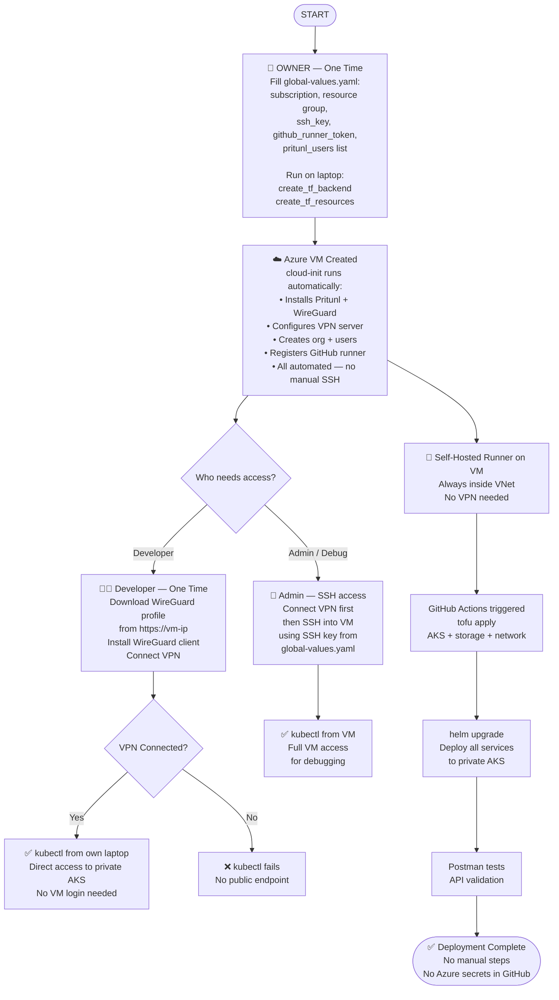

# Private AKS Cluster + VPN Access + Self-Hosted Runner — Implementation Plan

## Goal

- AKS API server: **private** (not accessible from internet)
- Developers: connect via **Pritunl VPN (WireGuard)** → then `kubectl` works
- GitHub Actions: use **self-hosted runner VM** inside VNet (can reach private API)
- Website/domain: **stays public** (nginx-public-ingress keeps public IP)
- All provisioning: **OpenTofu + GitHub Actions**

---

## VPN Solution: Pritunl (open source, free tier)

| | Azure VPN Gateway | Pritunl on VM |
|--|--|--|
| Cost | ~₹8,300/month | ₹0 extra (same runner VM) |
| Protocol | IKEv2 / OpenVPN | WireGuard (faster, modern) |
| Management | Azure Portal | Pritunl web UI |
| Auth | Cert or Entra ID | Username + password + cert |
| HA | Built-in | Single VM (fine for dev/sandbox) |
| Open source | No | Yes (AGPLv3) |

One VM = Pritunl VPN server + GitHub Actions self-hosted runner.
Extra cost vs current: **~₹1,600/month** (VM only).

---

## Architecture

**Before:**
```
Internet → nginx-public-ingress (public LB) → AKS pods
Developer → kubectl → AKS API server (PUBLIC)
GitHub Actions (github-hosted runner) → AKS API server (PUBLIC)
```

**After:**
```
Internet → nginx-public-ingress (public LB) → AKS pods   ← unchanged
Developer → Pritunl VPN → VNet → AKS private API server
GitHub Actions (self-hosted runner VM in VNet) → AKS private API server
```

---

## How GitHub Actions Works With Self-Hosted Runner

Currently GitHub-hosted runner (outside VNet) runs infra + deployment.
With private cluster, `helm`/`kubectl` from github-hosted runner fails — no route to private API server.

Self-hosted runner = an agent program running on the VM inside VNet.
VM connects **outbound** to GitHub (no inbound ports needed for runner).
GitHub sends jobs to VM → VM runs them inside VNet → can reach private AKS.

**Single job, single runner:**
```yaml
runs-on: [self-hosted, azure]   # all steps run on VM
steps:
  - create_tf_resources         # tofu — Azure APIs (public) + az aks get-credentials
  - install_helm_components     # helm → private AKS ✓
  - run_post_install
  - create_client_forms
```

No need to split infra/deploy into separate jobs — VM handles everything.

---

## Authentication: Managed Identity (no secrets)

Currently GitHub Actions uses **Azure OIDC** — credentials stored as GitHub secrets (`AZURE_CLIENT_ID`, `AZURE_TENANT_ID`, `AZURE_SUBSCRIPTION_ID`).

With self-hosted runner + VM managed identity, **no Azure credentials needed anywhere**:

```yaml
# Remove from workflow — no longer needed:
- name: Azure Login
  uses: azure/login@v2
  with:
    client-id: ${{ secrets.AZURE_CLIENT_ID }}
    ...
```

VM managed identity auto-authenticates with Azure. `az`, `tofu`, `helm` just work.

In `tf.sh`, replace OIDC vars with managed identity flag:
```bash
export ARM_USE_MSI=true   # use VM managed identity
```

GitHub Azure secrets can be deleted once self-hosted runner is active.

**Security improvement:**
- No credentials exist anywhere — nothing to steal
- Even if GitHub repo is compromised, no Azure secrets exposed
- VM is inside private VNet — not reachable from internet
- Current OIDC tokens are short-lived but still real credentials; managed identity tokens never leave Azure

---

## Full Step-by-Step Execution Plan

### Phase 1 — Code Changes (PR)

Raise as PR before any deployment.

1. `opentofu/azure/modules/network/main.tf` — add runner subnet
2. `opentofu/azure/modules/vm/` — new module (VM + NSG + public IP + cloud-init)
3. `opentofu/azure/modules/aks/main.tf` — enable `private_cluster_enabled = true`
4. `opentofu/azure/template/vm/terragrunt.hcl` — new template
5. `opentofu/azure/_common/vm.hcl` — defaults
6. `private-repo-setup/workflows/sunbird-spark-platform.yaml` — `runs-on: [self-hosted, azure]`, remove Azure login step, use `ARM_USE_MSI=true`
7. `opentofu/azure/template/global-values.yaml` — add vm variables (size, ssh key, runner token)

---

### Phase 2 — Manual First Run (owner's laptop, once per env)

Requires: **Azure Owner role** + `az login` + SSH key + GitHub org admin access.

#### Step 1: Create state backend
```bash
cd opentofu/azure/<env-name>
./install.sh create_tf_backend
```

#### Step 2: Create VM + all infra
```bash
./install.sh create_tf_resources
```

OpenTofu creates in order: network → keys → storage → vm → workload-identity → aks

VM module creates:
- Ubuntu 22.04 VM (Standard_B2s) in runner subnet
- Public IP, NSG (allow UDP 1194, TCP 443, TCP 22)
- User-assigned managed identity with required roles

cloud-init runs automatically on first VM boot (~5 min):
- Installs: Pritunl, WireGuard, kubectl, helm, opentofu, terragrunt, az CLI, jq, yq, rclone, Docker
- Downloads + registers GitHub Actions runner to GitHub org/repo
- Runner appears as **Idle** in GitHub → Settings → Actions → Runners

> Wait ~5 minutes after VM creation for cloud-init to complete before proceeding.

---

### Phase 3 — Pritunl One-Time Setup (~10 min, admin only)

Never needs to be repeated after initial setup.

#### Step 1: Get setup key
```bash
ssh adminuser@<vm-public-ip>
sudo pritunl setup-key
```

#### Step 2: Open Pritunl web UI
```
https://<vm-public-ip>
```
Paste setup key → login → change default password.

#### Step 3: Create VPN server
- Organizations → Add Organization (e.g. `sunbird-spark`)
- Servers → Add Server:
  - Protocol: WireGuard
  - Port: 1194 (UDP)
  - DNS: `168.63.129.16` (Azure internal DNS — needed for AKS private DNS)
  - Network: `172.16.0.0/24` (VPN client IP pool)
- Attach organization to server → Start server
- Add route: `10.0.0.0/8` (routes VNet + AKS service CIDR through VPN)

#### Step 4: Add developer users
- Users → Add User (one per developer)
- Each user downloads WireGuard profile from Pritunl portal

---

### Phase 4 — Developer VPN Setup (~5 min, per developer)

1. Install WireGuard client (Windows / Mac / Linux)
2. Open `https://<vm-public-ip>` → login → download `.conf` profile
3. Import profile into WireGuard → Connect
4. `kubectl get pods -n sunbird` → works ✓

Without VPN: kubectl fails — private cluster has no public endpoint.

---

### Phase 5 — All Future Deployments (GitHub Actions, automated)

```
Developer pushes / triggers workflow
  → GitHub sends job to self-hosted runner (VM)
  → VM runs: tofu + helm + kubectl
  → private AKS reachable (VM inside VNet)
  → deployment complete
```

No manual steps needed after initial setup.

---

## Azure Resources Added

| Resource | Purpose |
|----------|---------|
| runner-subnet (new subnet in VNet) | Isolates VM from AKS nodes |
| Runner VM — Standard_B2s | Pritunl VPN server + GitHub Actions runner |
| Public IP for VM | Developers connect VPN here |
| NSG on VM | UDP 1194 (WireGuard) + TCP 443 (Pritunl UI) + TCP 22 (SSH) |
| User-assigned Managed Identity | VM authenticates to Azure without credentials |

---

## VM Managed Identity Roles (assigned by OpenTofu)

| Role | Scope | Why |
|------|-------|-----|
| Contributor | Resource group | OpenTofu create/update/delete all resources |
| AKS Cluster Admin | AKS resource | kubectl + helm against private cluster |
| Storage Blob Data Contributor | Storage account | Read/write OpenTofu state |
| Key Vault Secrets User | Key Vault | Read secrets |

---

## Access Required

### Infra engineer (Phase 2 — one time)
- Azure **Owner role** — Contributor not enough; OpenTofu assigns roles to managed identity which requires Owner
- `az login` on laptop
- SSH private key for VM admin access
- GitHub org admin — to generate runner registration token

### Developer (ongoing)
- WireGuard client + Pritunl user account (created by admin)
- No Azure access needed

### GitHub Actions (automated)
- No credentials — VM managed identity handles all Azure auth
- GitHub repo access via runner registration token (set once in cloud-init)

---

## Cost

| Approach | Monthly Cost |
|----------|-------------|
| Current (github-hosted + public cluster) | ₹0 extra |
| Azure VPN Gateway + self-hosted runner VM | ~₹9,900/month |
| **This plan (Pritunl on runner VM)** | **~₹1,600/month** |

---

## Security

- Private AKS = no public API endpoint — stolen kubeconfig useless without VPN
- Managed identity = no credentials exist anywhere — nothing to steal from GitHub secrets
- VM inside private VNet — not reachable from internet (only VPN + NSG rules)
- VPN alone sufficient — no WiFi/IP allowlisting needed
- Developers can work from anywhere — VPN is the gate, not the network location

---

## End-to-End Flow


