# Private AKS Cluster + Developer Access + Self-Hosted Runner — Implementation Plan

## Goal

- AKS API server: **private** (not accessible from internet)
- Developers: access cluster via **VPN** (Pritunl/WireGuard) **or Azure Bastion** — controlled by `vpn_enabled` flag
- GitHub Actions: use **self-hosted runner VM** inside VNet (can reach private API)
- Website/domain: **stays public** (nginx-public-ingress keeps public IP)
- All provisioning: **OpenTofu + GitHub Actions**

---

## Developer Access Options

Set `vpn_enabled` in `global-values.yaml` to choose:

| | VPN (Pritunl + WireGuard) | Azure Bastion |
|--|--|--|
| **`vpn_enabled`** | `true` | `false` |
| **How developer connects** | WireGuard client → `kubectl` from own laptop | Azure Portal → Bastion → SSH into runner VM → `kubectl` from VM |
| **VM needs public IP** | Yes (VPN endpoint) | No |
| **Extra infra** | None (VPN runs on same runner VM) | `AzureBastionSubnet` + `azurerm_bastion_host` resource |
| **Extra cost** | ₹0 (same VM) | ~₹1,500–6,000/month (Basic/Standard Bastion SKU) |
| **Client setup** | Install WireGuard, download profile | Azure Portal access only |
| **Best for** | Teams wanting direct `kubectl` from laptops | Teams preferring no VPN client, portal-based access |

> **VPN is recommended** for developer productivity — direct `kubectl`/`helm` from any machine. Bastion is simpler to set up but requires all cluster work to be done inside the VM via SSH.

---

## VPN Solution: Pritunl + WireGuard (both free, open source)

**WireGuard and Pritunl are two different tools working together:**

| | Role |
|--|--|
| **WireGuard** | VPN protocol — the actual encryption + secure tunnel. No UI, runs at kernel level. 100% free, open source. |
| **Pritunl** | Management layer on top of WireGuard — web UI to add users, download profiles, manage server. Free tier supports unlimited users + servers. |

WireGuard = engine. Pritunl = dashboard + controls for that engine. Both installed on same VM. Developer only uses Pritunl web UI — WireGuard runs in background automatically.

**Pritunl free tier is sufficient** — paid enterprise features (SSO, audit logs) not needed here.

**Why Pritunl over Azure VPN Gateway:**

| | Azure VPN Gateway | Pritunl on VM |
|--|--|--|
| Cost | ~₹8,300/month | ₹0 extra (same runner VM) |
| Protocol | IKEv2 / OpenVPN | WireGuard (faster, modern) |
| Management | Azure Portal | Pritunl web UI |
| Auth | Cert or Entra ID | Username + password + cert |
| HA | Built-in | Single VM (fine for dev/sandbox) |
| Open source | No | Yes (AGPLv3) |

One VM = Pritunl VPN server + GitHub Actions self-hosted runner.
Extra cost vs current: **~₹1,600/month** (VM only).

---

## Architecture

**Before:**
```
Internet → nginx-public-ingress (public LB) → AKS pods
Developer → kubectl → AKS API server (PUBLIC)
GitHub Actions (github-hosted runner) → AKS API server (PUBLIC)
```

**After (vpn_enabled: true):**
```
Internet → nginx-public-ingress (public LB) → AKS pods   ← unchanged
Developer → Pritunl VPN (WireGuard) → VNet → AKS private API server
GitHub Actions (self-hosted runner VM in VNet) → AKS private API server
```

**After (vpn_enabled: false — Bastion):**
```
Internet → nginx-public-ingress (public LB) → AKS pods   ← unchanged
Developer → Azure Portal → Azure Bastion → runner VM (SSH) → kubectl inside VNet
GitHub Actions (self-hosted runner VM in VNet) → AKS private API server
```

> GitHub Actions path is identical in both cases — runner VM is always inside VNet.

---

## How GitHub Actions Works With Self-Hosted Runner

Currently GitHub-hosted runner (outside VNet) runs infra + deployment.
With private cluster, `helm`/`kubectl` from github-hosted runner fails — no route to private API server.

Self-hosted runner = an agent program running on the VM inside VNet.
VM connects **outbound** to GitHub (no inbound ports needed for runner).
GitHub sends jobs to VM → VM runs them inside VNet → can reach private AKS.

**Single job, single runner:**
```yaml
runs-on: [self-hosted, azure]   # all steps run on VM
steps:
  - create_tf_resources         # tofu — Azure APIs (public) + az aks get-credentials
  - install_helm_components     # helm → private AKS ✓
  - run_post_install
  - create_client_forms
```

No need to split infra/deploy into separate jobs — VM handles everything.

---

## Authentication: Managed Identity (no secrets)

Currently GitHub Actions uses **Azure OIDC** — credentials stored as GitHub secrets (`AZURE_CLIENT_ID`, `AZURE_TENANT_ID`, `AZURE_SUBSCRIPTION_ID`).

With self-hosted runner + VM managed identity, **no Azure credentials needed anywhere**:

```yaml
# Remove from workflow — no longer needed:
- name: Azure Login
  uses: azure/login@v2
  with:
    client-id: ${{ secrets.AZURE_CLIENT_ID }}
    ...
```

VM managed identity auto-authenticates with Azure. `az`, `tofu`, `helm` just work.

In `tf.sh`, replace OIDC vars with managed identity flag:
```bash
export ARM_USE_MSI=true   # use VM managed identity
```

GitHub Azure secrets can be deleted once self-hosted runner is active.

**Security improvement:**
- No credentials exist anywhere — nothing to steal
- Even if GitHub repo is compromised, no Azure secrets exposed
- VM is inside private VNet — not reachable from internet
- Current OIDC tokens are short-lived but still real credentials; managed identity tokens never leave Azure

---

## Full Step-by-Step Execution Plan

### Phase 1 — Code Changes (PR)

> These changes are made **once in the installer repo** and apply to every new environment automatically.

**Why each change is needed:**

| What changes | Why |
|---|---|
| Add `runner-subnet` to network module | VM needs its own isolated subnet inside VNet |
| `setup-installer-vm.sh` creates VNet + subnets + VM | VNet must exist before OpenTofu runs (runner VM needs to be inside it); script places VM in runner-subnet |
| `skip_network_module` flag in network module | When VNet pre-created by script, OpenTofu uses data sources; when false, OpenTofu creates resources |
| `private_cluster_enabled` flag in AKS module | Makes API server private — no public endpoint |
| `vpn_enabled` flag controls access method | `true` = Pritunl VPN installed on VM; `false` = Azure Bastion created (no VPN) |
| Network module: `AzureBastionSubnet` + Bastion resource when `vpn_enabled: false` | Bastion requires dedicated `/26` subnet with fixed name `AzureBastionSubnet` |
| Update GitHub Actions workflow | Switch from github-hosted runner to self-hosted VM runner; use managed identity instead of OIDC |
| Add vm + access variables to `global-values.yaml` template | Operator fills once: VM size, runner token, `vpn_enabled`, VPN users (if VPN) |

Without these changes, every new environment would need manual VM setup and github-hosted runners that can't reach private clusters.

---

### Phase 2 — Manual First Run (owner's laptop, once per env)

> **Only two commands run manually. Everything else is automated via GitHub Actions after this.**

Requires: **Azure Owner role** + `az login` + SSH key + GitHub org admin access — one time only.

#### Step 1: Create state backend
```bash
cd opentofu/azure/<env-name>
./install.sh create_tf_backend
```
Creates Azure Storage for OpenTofu state. Needed once per environment.

#### Step 2: Create VNet + subnets + VM + managed identity + GitHub runner
```bash
# Edit variables at top first: tenant, subscription, resource group,
# github_org, github_runner_token, vpn_enabled, pritunl users (if vpn_enabled=true)
bash private-repo-setup/scripts/setup-installer-vm.sh
```

Script handles everything automatically:
- Creates VNet + AKS subnet + runner subnet (names match OpenTofu convention)
- Creates VM (Standard_B2s, Ubuntu 22.04) in runner-subnet
- Creates user-assigned managed identity with least-privilege custom role
- cloud-init on VM boot: installs kubectl, helm, tofu, az CLI, Docker
- If `vpn_enabled=true`: installs Pritunl + WireGuard, configures VPN, opens UDP 1194 / TCP 443; VM gets public IP
- If `vpn_enabled=false`: skips VPN entirely; VM has no public IP (Bastion provides access after infra step)
- Registers GitHub Actions runner to your org/repo

cloud-init runs automatically on first VM boot (~5 min):
- Installs: kubectl, helm, opentofu, terragrunt, az CLI, jq, yq, rclone, Docker
- If VPN: Pritunl + WireGuard, VPN server configured + users added
- Registers GitHub Actions runner → appears as **Idle** in GitHub → Settings → Actions → Runners

> Wait ~5 minutes for cloud-init to complete. Once runner shows Idle — owner's job is done.

> **If `vpn_enabled: false`**: Azure Bastion is created in the next step (Phase 3 `create_tf_resources`). Developer access via Bastion is only available after that step completes.

**After this point, owner's laptop is never needed again.**

---

### Phase 3 — All Infra + Deployments (GitHub Actions, automated)

Self-hosted runner on VM now handles everything:

```
Trigger: GitHub Actions workflow (manual or on push)

Job runs on: [self-hosted, azure]  ← VM inside VNet

Steps:
  create_tf_resources  → creates AKS + storage + network + Key Vault
  install_helm         → deploys all services to private AKS
  run_post_install     → Postman API tests
  create_client_forms  → seed forms
```

VM managed identity authenticates to Azure — no credentials needed anywhere.

---

### Phase 4 — Developer Access Setup (per developer)

#### Option A — VPN (`vpn_enabled: true`) — ~5 min

1. Install WireGuard client (Windows / Mac / Linux)
2. Open `https://<vm-public-ip>` → login to Pritunl UI → download `.conf` profile
3. Import profile into WireGuard → Connect
4. `kubectl get pods -n sunbird` → works directly from laptop ✓

#### Option B — Azure Bastion (`vpn_enabled: false`)

> Bastion is created automatically during `create_tf_resources` (Phase 3). No client install needed.

1. Go to Azure Portal → Resource Group → Bastion resource
2. Click **Connect** → select runner VM → SSH
3. Login with `azureuser`
4. Run `kubectl get pods -n sunbird` → works from inside VM ✓

Bastion SSH key is in `~/.ssh/` on the operator's laptop (generated during `setup-installer-vm.sh`). Share the private key with developers who need VM access, or use Azure Portal's browser-based SSH (no key needed).

> **Limitation:** All `kubectl`/`helm` work must be done inside the VM via SSH session. Cannot run from developer's own laptop without VPN.

---

---

## Azure Resources Added

### Always created

| Resource | Purpose |
|----------|---------|
| VNet + AKS subnet + runner-subnet | Created by `setup-installer-vm.sh` before OpenTofu runs |
| Runner VM — Standard_B2s | GitHub Actions self-hosted runner (+ VPN server if `vpn_enabled: true`) |
| User-assigned Managed Identity | VM authenticates to Azure without credentials |

### When `vpn_enabled: true`

| Resource | Purpose |
|----------|---------|
| Public IP for VM | Developers connect to Pritunl VPN here |
| NSG rules: UDP 1194 + TCP 443 | WireGuard VPN traffic + Pritunl web UI |

### When `vpn_enabled: false`

| Resource | Purpose |
|----------|---------|
| `AzureBastionSubnet` (`/26`) | Required dedicated subnet for Azure Bastion (fixed name, cannot be changed) |
| Azure Bastion (Basic SKU) | Separate Azure-managed PaaS service — **not on the runner VM**. Provides browser-based SSH proxy into the runner VM via Azure Portal. Created by OpenTofu during `create_tf_resources`. |
| No VM public IP | VM stays fully private inside VNet — Bastion handles all inbound access |

> **Azure Bastion is a standalone Azure PaaS service** that lives in `AzureBastionSubnet`, separate from the runner VM in `runner-subnet`. The runner VM has no public IP. Developers SSH into the runner VM through Bastion — once inside, they run `kubectl` commands against the private AKS cluster from within the VNet.

---

## VM Managed Identity Roles (assigned by OpenTofu)

| Role | Scope | Why |
|------|-------|-----|
| Contributor | Resource group | OpenTofu create/update/delete all resources |
| AKS Cluster Admin | AKS resource | kubectl + helm against private cluster |
| Storage Blob Data Contributor | Storage account | Read/write OpenTofu state |

---

## Access Required

> **These requirements apply ONE TIME ONLY** — the person who runs Phase 2 (`create_tf_backend` + `create_tf_resources`) from their laptop. After VM is created and runner is registered, none of these are needed again.

### Infra engineer — one time only, Phase 2

| Requirement | Why | When needed |
|-------------|-----|-------------|
| Azure **Owner role** | OpenTofu assigns roles to VM managed identity — requires Owner, Contributor is not enough | Phase 2 only |
| `az login` on laptop | OpenTofu authenticates to Azure to create resources | Phase 2 only |
| GitHub org admin | Generate runner registration token (Settings → Actions → Runners → New runner) | Phase 2 only |

SSH key is **auto-generated** by OpenTofu (no need to provide one). Retrieve private key after VM creation:
```bash
cd opentofu/azure/<env>/vm
tofu output -raw runner_ssh_private_key > runner.pem && chmod 600 runner.pem
ssh azureuser@<vm-public-ip> -i runner.pem
```

After Phase 2: VM exists, runner registered, managed identity has all roles. **Owner access no longer needed.**

### Developer — ongoing

**VPN path (`vpn_enabled: true`):**
- WireGuard client installed + Pritunl user account (created by admin, listed in `global-values.yaml`)
- No Azure access needed

**Bastion path (`vpn_enabled: false`):**
- Azure Portal access (Reader role on resource group is sufficient)
- Or SSH private key from operator to connect via Bastion CLI

### GitHub Actions — fully automated
- No credentials needed — VM managed identity handles all Azure auth automatically
- No OIDC, no service principal, no GitHub Azure secrets required

---

## Cost

| Approach | Monthly Cost |
|----------|-------------|
| Current (github-hosted + public cluster) | ₹0 extra |
| Azure VPN Gateway + self-hosted runner VM | ~₹9,900/month |
| **`vpn_enabled: true` — Pritunl VPN on runner VM** | **~₹1,600/month** (VM only) |
| **`vpn_enabled: false` — Azure Bastion + runner VM** | **~₹3,100–8,100/month** (VM + Bastion Basic/Standard SKU) |

---

## Security

- Private AKS = no public API endpoint — stolen kubeconfig useless without VPN
- Managed identity = no credentials exist anywhere — nothing to steal from GitHub secrets
- VM inside private VNet — not reachable from internet (only VPN + NSG rules)
- VPN alone sufficient — no WiFi/IP allowlisting needed
- Developers can work from anywhere — VPN is the gate, not the network location

---

## End-to-End Flow

```mermaid
flowchart TD
    A([START]) --> B

    B["🔧 OWNER — One Time Only\nSet vpn_enabled in global-values.yaml\nFill variables at top of script:\ntenant, subscription, resource group,\ngithub_runner_token\n\nRun on laptop:\nbash setup-installer-vm.sh\n\nCreates: VNet + subnets + runner VM\n+ managed identity + GitHub runner"]

    B --> ACCESS{"vpn_enabled?"}

    ACCESS -->|true| VPN_SETUP["☁️ cloud-init on VM (~5 min):\n• Installs Pritunl + WireGuard\n• Configures VPN server + users\n• VM gets public IP\n• Registers GitHub Actions runner\n• Runner shows Idle in GitHub"]

    ACCESS -->|false| BASTION_SETUP["☁️ cloud-init on VM (~5 min):\n• No VPN installed\n• VM has no public IP\n• Registers GitHub Actions runner\n• Runner shows Idle in GitHub\n\nAzure Bastion created later\nduring create_tf_resources"]

    VPN_SETUP --> RUNNER["🤖 Self-Hosted Runner on VM\nAlways inside VNet\nManaged identity = no credentials"]
    BASTION_SETUP --> RUNNER

    RUNNER --> INFRA["GitHub Actions: create_tf_resources\nCreates: AKS (private) + storage\n+ Key Vault + remaining infra\n\nvpn_enabled=false: also creates\nAzureBastionSubnet + Azure Bastion\n(separate PaaS service, not on VM)"]

    INFRA --> DEPLOY["GitHub Actions: install_helm\nDeploys all services to private AKS"]
    DEPLOY --> POST["Postman tests + forms\nAPI validation"]
    POST --> DONE([✅ Infra + platform ready])

    DONE --> DEV{"Developer access?"}

    DEV -->|vpn_enabled=true| VPN_DEV["👨‍💻 Developer — One Time\nInstall WireGuard client\nDownload profile from\nhttps://vm-public-ip\nConnect VPN"]

    DEV -->|vpn_enabled=false| BASTION_DEV["👨‍💻 Developer\nAzure Portal →\nBastion → runner VM → SSH\n\nNo client install needed\nNo public IP on VM"]

    VPN_DEV --> VPN_ACCESS["✅ kubectl from own laptop\nDirect access to private AKS"]

    BASTION_DEV --> BASTION_ACCESS["✅ kubectl from inside runner VM\nvia SSH session\n\nNote: Azure Bastion is a separate\nPaaS service in AzureBastionSubnet\n— not installed on the runner VM"]
```


